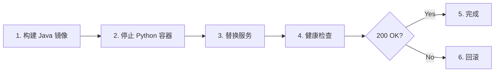

# Docker 与 Nginx 部署设计

## 现状

```
现有部署拓扑 (Python)
─────────────────────────────────────────────
                    ┌──────────┐
                    │  Nginx   │ :80/:443
                    └────┬─────┘
           ┌─────────────┼─────────────┐
           ▼             ▼             ▼
    api.${DOMAIN}  app.${DOMAIN}  admin.${DOMAIN}
    proxy_pass →   /api/ →        /api/ →
           │             │             │
           ▼             ▼             ▼
    ┌──────────┐  ┌──────────┐  ┌──────────┐
    │ backend  │  │  front   │  │  admin   │
    │  :8000   │  │   :80    │  │   :80    │
    │ FastAPI  │  │  Vant    │  │ Element  │
    └──────────┘  └──────────┘  └──────────┘
```

## 目标

```
目标部署拓扑 (Java)
─────────────────────────────────────────────
                    ┌──────────┐
                    │  Nginx   │ :80/:443
                    └────┬─────┘
           ┌─────────────┼─────────────┐
           ▼             ▼             ▼
    api.DOMAIN     app.DOMAIN    admin.DOMAIN
        │              │              │
        ▼              │              │
    ┌──────────┐       │              │
    │ backend  │       │              │
    │  :8000   │◄──────┼──────────────┘
    │ Java     │  /api/ 前缀 → 后端
    │ ZGC      │        │
    └──────────┘        ▼             ▼
                   ┌──────────┐  ┌──────────┐
                   │  front   │  │  admin   │
                   │   :80    │  │   :80    │
                   └──────────┘  └──────────┘
```

## Dockerfile

```dockerfile
# backend/newbackend/Dockerfile
# 多阶段构建: Maven 编译 → JRE 运行

FROM maven:3.9-eclipse-temurin-17 AS build
WORKDIR /app
COPY pom.xml .
COPY continew-common/pom.xml continew-common/
COPY continew-system/pom.xml continew-system/
COPY continew-server/pom.xml continew-server/
RUN mvn dependency:go-offline -B
COPY . .
RUN mvn package -DskipTests -B

FROM bellsoft/liberica-openjdk-debian:17.0.14
COPY --from=build /app/continew-server/target/*.jar /app/app.jar
WORKDIR /app
EXPOSE 8000
ENTRYPOINT ["java", \
    "-jar", \
    "-XX:+UseZGC", \
    "-Djava.security.egd=file:/dev/./urandom", \
    "app.jar"]
```

> 沿用 ContiNew 的 `bellsoft/liberica-openjdk-debian` 基础镜像 + ZGC 参数。

## Nginx 配置

```nginx
# backend/nginx/nginx.conf（核心变更）
# 变更点: backend 服务名不变，端口不变，只换容器内容

upstream backend {
    server backend:8000;    # ← 端口不变，容器内部 Java 替代 Python
}

server {
    listen 443 ssl http2;
    server_name api.${DOMAIN};

    ssl_certificate     /etc/nginx/certs/fullchain.pem;
    ssl_certificate_key /etc/nginx/certs/privkey.pem;

    location / {
        proxy_pass http://backend;
        proxy_set_header Host               $host;
        proxy_set_header X-Real-IP          $remote_addr;
        proxy_set_header X-Forwarded-For    $proxy_add_x_forwarded_for;
        proxy_set_header X-Forwarded-Proto  $scheme;
    }
}

# app.DOMAIN 和 admin.DOMAIN 的 /api/ → backend 保持不变
```

> **核心原则**: Nginx 配置零改动。`backend:8000` 容器内部从 FastAPI 换成 Java，对 Nginx 完全透明。

## docker-compose.yml

```yaml
# 项目根 docker-compose.yml（变更摘要）
version: '3'
services:
  mysql:
    image: mysql:8.4
    environment:
      MYSQL_ROOT_PASSWORD: ${MYSQL_ROOT_PASSWORD}
      MYSQL_DATABASE: life_assistant

  redis:
    image: redis:7-alpine

  backend:
    build: ./backend/newbackend
    ports:
      - '8000:8000'
    environment:
      PROFILES_ACTIVE: ${PROFILES_ACTIVE:-prod}
      DB_HOST: mysql
      DB_PORT: 3306
      DB_NAME: life_assistant
      DB_USER: ${MYSQL_USER}
      DB_PWD: ${MYSQL_PASSWORD}
      REDIS_HOST: redis
      SECRET_KEY: ${SECRET_KEY}
    depends_on:
      - mysql
      - redis

  nginx:
    build: ./backend/nginx
    ports:
      - '80:80'
      - '443:443'
    depends_on:
      - backend

  front:
    build: ./front/vue3-vant-mobile

  admin:
    build: ./admin_front/vue3-element-admin
```

## 变更对比

| 组件 | 当前 (Python) | 目标 (Java) |
|------|-------------|------------|
| Dockerfile | `python:3.10` + UV | `maven:3.9` → `bellsoft-liberica:17` |
| 基础镜像大小 | ~200MB | ~128MB |
| JVM 参数 | 无 | ZGC + urandom |
| Nginx upstream | `backend:8000` | `backend:8000` (**不变**) |
| docker-compose 服务名 | `backend` | `backend` (**不变**) |
| 数据库名 | `life_assistant` | `life_assistant` (**不变**) |

## 部署流程


