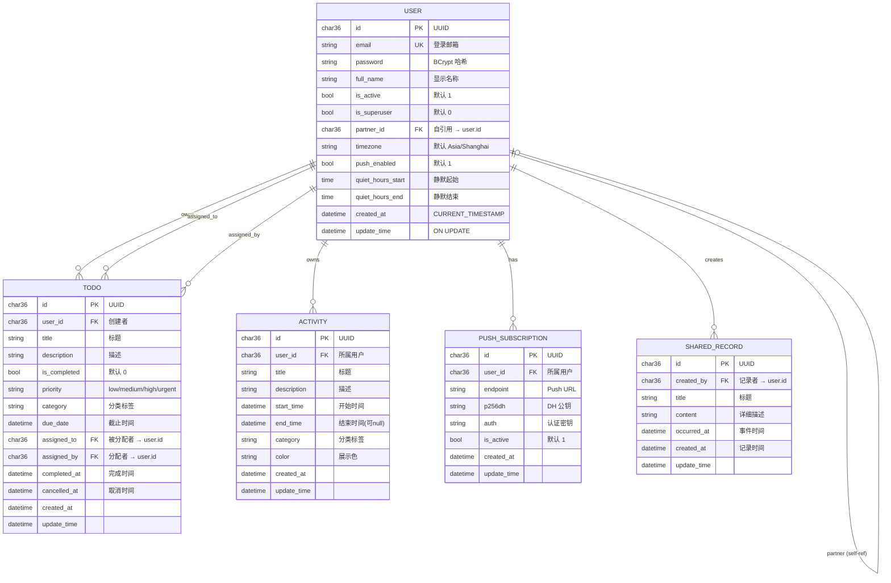
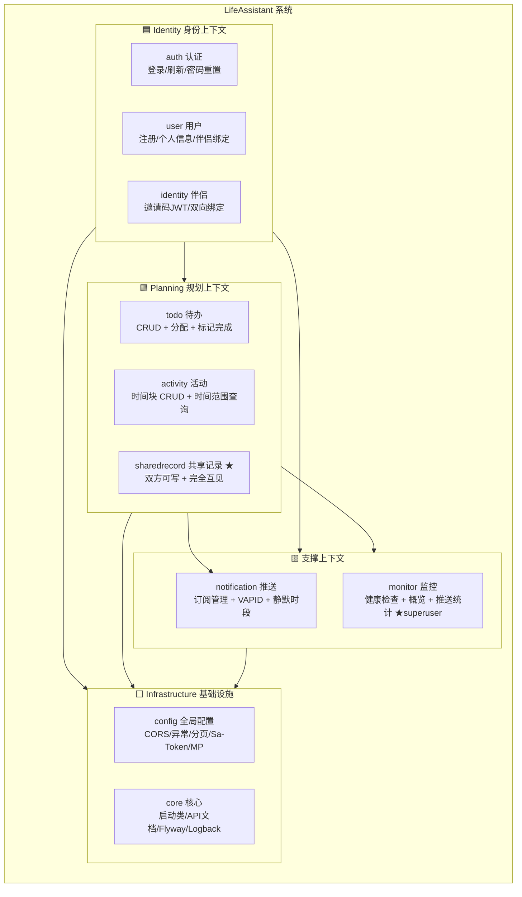
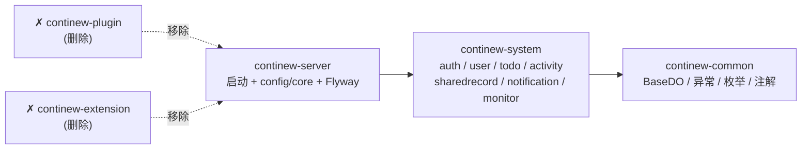

## 起点

`backend/newbackend/continew-admin/` 是 ContiNew Admin v4.2.0-SNAPSHOT 原始模板。本阶段仅做设计。**核心改造**：包名 `top.continew.admin` → `top.lifeassistant`，启动类 `ContiNewAdminApplication` → `LifeAssistantApplication`。

## 数据模型设计

### ER 图（完整字段 + 关系）



### 表 1: `user` — 用户

邮箱唯一标识，伴侣互绑，推送偏好。

| 字段 | 类型 | 必填 | 说明 |
|------|------|------|------|
| `id` | CHAR(36) PK | 是 | UUID |
| `email` | VARCHAR(255) UNIQUE | 是 | 登录邮箱 |
| `password` | VARCHAR(255) | 是 | BCrypt 哈希 |
| `full_name` | VARCHAR(255) | 否 | 显示名称 |
| `is_active` | TINYINT(1) | 是 | 默认 1 |
| `is_superuser` | TINYINT(1) | 是 | 默认 0 |
| `partner_id` | CHAR(36) | 否 | 自引用 FK → user.id |
| `timezone` | VARCHAR(64) | 是 | 默认 Asia/Shanghai |
| `push_enabled` | TINYINT(1) | 是 | 默认 1 |
| `quiet_hours_start` | TIME | 否 | 静默起始 |
| `quiet_hours_end` | TIME | 否 | 静默结束 |
| `created_at` | DATETIME | 是 | 创建时间，默认 CURRENT_TIMESTAMP |
| `update_time` | DATETIME | 是 | 更新时间，ON UPDATE CURRENT_TIMESTAMP |

### 表 2: `todo` — 待办

点状任务，可标记完成、分配伴侣。

| 字段 | 类型 | 必填 | 说明 |
|------|------|------|------|
| `id` | CHAR(36) PK | 是 | UUID |
| `user_id` | CHAR(36) FK | 是 | 创建者 |
| `title` | VARCHAR(255) | 是 | 标题 |
| `description` | VARCHAR(1024) | 否 | 描述 |
| `is_completed` | TINYINT(1) | 是 | 默认 0 |
| `priority` | VARCHAR(10) | 是 | low/medium/high/urgent，默认 medium |
| `category` | VARCHAR(64) | 否 | 分类标签 |
| `due_date` | DATETIME | 否 | 截止时间 |
| `assigned_to` | CHAR(36) | 否 | FK → user.id，被分配者 |
| `assigned_by` | CHAR(36) | 否 | FK → user.id，分配者 |
| `completed_at` | DATETIME | 否 | 完成时间 |
| `cancelled_at` | DATETIME | 否 | 取消时间 |
| `created_at` | DATETIME | 是 | 创建时间 |
| `update_time` | DATETIME | 是 | 更新时间，ON UPDATE CURRENT_TIMESTAMP |

### 表 3: `activity` — 时间块活动 (核心)

记录了"谁在什么时间段做了什么"。替代原有的 event / life_log / timeline_entry。

| 字段 | 类型 | 必填 | 说明 |
|------|------|------|------|
| `id` | CHAR(36) PK | 是 | UUID |
| `user_id` | CHAR(36) FK | 是 | 所属用户 |
| `title` | VARCHAR(255) | 是 | 标题 |
| `description` | VARCHAR(1024) | 否 | 描述 |
| `start_time` | DATETIME | 是 | 开始时间 |
| `end_time` | DATETIME | 否 | 结束时间（可为 null = 时间点） |
| `category` | VARCHAR(64) | 否 | 分类标签（如"运动""工作""用餐"） |
| `color` | VARCHAR(7) | 否 | 展示色 (#RRGGBB) |
| `created_at` | DATETIME | 是 | 创建时间 |
| `update_time` | DATETIME | 是 | 更新时间，ON UPDATE CURRENT_TIMESTAMP |

> **伴侣共享**: 绑定伴侣后，查询伴侣活动 = `WHERE user_id = partner_id`。全有或全无，不设 `shared` 字段。
> **Phase 2 扩展**: 后续可加 `planned_type` 字段区分是"计划"还是"实际执行"，用于 AI 分析差异。

### 表 4: `push_subscription` — Web Push 订阅

| 字段 | 类型 | 必填 | 说明 |
|------|------|------|------|
| `id` | CHAR(36) PK | 是 | UUID |
| `user_id` | CHAR(36) FK | 是 | 所属用户 |
| `endpoint` | VARCHAR(1024) | 是 | Push Service URL |
| `p256dh` | VARCHAR(256) | 是 | DH 公钥 |
| `auth` | VARCHAR(256) | 是 | 认证密钥 |
| `is_active` | TINYINT(1) | 是 | 默认 1，410 时置 0 |
| `created_at` | DATETIME | 是 | 创建时间 |
| `update_time` | DATETIME | 是 | 更新时间，ON UPDATE CURRENT_TIMESTAMP |

### 表 5: `shared_record` — 一起做过的事（第一优先功能）

伴侣绑定后共享的记录本，双方均可添加和查看。查询时同时返回两人的记录。

| 字段 | 类型 | 必填 | 说明 |
|------|------|------|------|
| `id` | CHAR(36) PK | 是 | UUID |
| `created_by` | CHAR(36) FK | 是 | 记录者 user.id |
| `title` | VARCHAR(255) | 是 | 标题（如"一起去看了电影"） |
| `content` | VARCHAR(2048) | 否 | 详细描述 |
| `occurred_at` | DATETIME | 否 | 事件发生时间（区别于记录时间） |
| `created_at` | DATETIME | 是 | 记录时间 |
| `update_time` | DATETIME | 是 | 更新时间，ON UPDATE CURRENT_TIMESTAMP |

> **查询逻辑**: `WHERE created_by IN (current_user.id, partner_id)` → 两人看到完全相同的列表。
> **权限**: 创建者可以修改/删除自己的记录，不能修改对方的。

### ER 关系

```
user ── 1:N ── todo (user_id)
user ── 1:N ── activity (user_id)
user ── 1:N ── push_subscription (user_id)
user ── 1:N ── shared_record (created_by)
user ── 1:1 ── user (partner_id 自引用)
todo ── FK → user (assigned_to, assigned_by)
```

---

## API 端点设计

```
登录认证
──────────────────────────────────
POST   /api/v1/login/access-token          # OAuth2 form-data 登录
POST   /api/v1/auth/login                  # JSON 登录 → {access_token,token_type,refresh_token,expires_in}
POST   /api/v1/auth/refresh-token          # 刷新 ?refreshToken=xxx
DELETE /api/v1/auth/logout                 # 登出
POST   /api/v1/password-recovery/{email}   # 请求密码重置
POST   /api/v1/reset-password              # 执行重置 {token,new_password}

用户
──────────────────────────────────
POST   /api/v1/users/signup                # 注册 {email,password,full_name?}
GET    /api/v1/users/me                    # 当前用户
PATCH  /api/v1/users/me                    # 更新自身
PATCH  /api/v1/users/me/password           # 改密码
DELETE /api/v1/users/me                    # 删号
GET    /api/v1/users                       # ★ 分页列表
POST   /api/v1/users                       # ★ 创建用户
GET    /api/v1/users/{id}                  # 查看用户
PATCH  /api/v1/users/{id}                  # ★ 更新用户
DELETE /api/v1/users/{id}                  # ★ 删除用户

伴侣
──────────────────────────────────
POST   /api/v1/identity/invite             # 生成邀请码
POST   /api/v1/identity/bind-partner       # 接受邀请 {invite_token}

一起做过的事（第一优先功能）
──────────────────────────────────
POST   /api/v1/shared-records              # 添加记录
GET    /api/v1/shared-records              # 列表（两人全部记录，?start&end 按 occurred_at 过滤）
GET    /api/v1/shared-records/{id}         # 详情
PATCH  /api/v1/shared-records/{id}         # 更新（仅创建者可修改）
DELETE /api/v1/shared-records/{id}         # 删除（仅创建者可删除）

待办
──────────────────────────────────
POST   /api/v1/todos                        # 创建
GET    /api/v1/todos                        # 列表 ?is_completed&priority&category
GET    /api/v1/todos/{id}                   # 详情
PATCH  /api/v1/todos/{id}                   # 更新（is_completed=true → completed_at=now）
DELETE /api/v1/todos/{id}                   # 删除
POST   /api/v1/todos/{id}/assign            # 分配伴侣 {assigned_to_id}
GET    /api/v1/partner/todos                # 伴侣待办

活动（核心）
──────────────────────────────────
POST   /api/v1/activities                   # 创建
GET    /api/v1/activities                   # 列表 ?start&end&category
GET    /api/v1/activities/{id}              # 详情
PATCH  /api/v1/activities/{id}              # 更新
DELETE /api/v1/activities/{id}              # 删除
GET    /api/v1/partner/activities           # 伴侣活动（全量，绑定后可见）

推送
──────────────────────────────────
POST   /api/v1/push/subscribe               # 注册订阅
DELETE /api/v1/push/subscription            # 取消订阅
PUT    /api/v1/push/preferences              # 偏好设置
POST   /api/v1/push/test                     # 测试推送

管理后台
──────────────────────────────────
GET    /api/v1/admin/health                  # ★ 健康检查
GET    /api/v1/admin/stats/overview          # ★ 概览
GET    /api/v1/admin/stats/push              # ★ 推送统计
GET    /api/v1/admin/users                   # ★ 用户列表
```

★ = superuser 权限

---

## 代码架构设计

### 包结构

```
top.lifeassistant                          # ← 替换原 top.continew.admin
├── LifeAssistantApplication.java          # ← 替换原 ContiNewAdminApplication
├── config/
│   ├── GlobalExceptionHandler.java
│   ├── CorsConfig.java
│   ├── WebMvcConfig.java
│   └── MyBatisPlusConfig.java
├── auth/
│   ├── controller/AuthController.java
│   ├── service/AuthService.java
│   └── model/*.java
├── user/
│   ├── controller/{User,Identity}Controller.java
│   ├── service/{User,Identity}Service.java
│   ├── mapper/UserMapper.java
│   └── model/entity/UserDO.java, req/*, resp/*
├── todo/
│   ├── controller/TodoController.java
│   ├── service/TodoService.java
│   ├── mapper/TodoMapper.java
│   └── model/entity/TodoDO.java
├── activity/
│   ├── controller/ActivityController.java
│   ├── service/ActivityService.java
│   ├── mapper/ActivityMapper.java
│   └── model/entity/ActivityDO.java
├── sharedrecord/
│   ├── controller/SharedRecordController.java
│   ├── service/SharedRecordService.java
│   ├── mapper/SharedRecordMapper.java
│   └── model/entity/SharedRecordDO.java
├── notification/
│   ├── controller/PushController.java
│   ├── service/PushService.java
│   ├── scheduler/PushScheduler.java          # @Scheduled 提醒 + 摘要
│   ├── mapper/PushSubscriptionMapper.java
│   └── model/entity/PushSubscriptionDO.java
└── monitor/
    ├── controller/AdminController.java
    └── service/AdminService.java
```

### DDD 限界上下文与模块关系


```
                    依赖说明
                    ════════
  Identity → Planning    伴侣绑定后共享功能才生效
  Planning → Notif      待办提醒需要推送能力
  全部 → Infrastructure config/core 为所有模块提供基础能力
```

### Maven 模块映射



> **核心规则**: 伴侣上下文通过 `partner_id` 自引用建立共享空间。共享记录和活动都是"绑定后才可见"的模型，不需要独立的共享标记表。

### 核心业务逻辑

**一起做过的事（第一优先）**:
- 创建: `POST /shared-records` → `created_by = current_user.id`
- 查询: `WHERE created_by IN (current_user.id, partner_id) ORDER BY occurred_at DESC` → 两人看到完全一致的列表
- 权限: 仅创建者可修改/删除自己的记录

**伴侣绑定**: 用户 A 生成邀请码 (JWT, 24h) → 用户 B 用邀请码请求绑定 → 校验自绑定/重复绑定 → `A.partner_id=B.id` + `B.partner_id=A.id`

**伴侣活动查询**: `GET /partner/activities` → 校验 `current_user.partner_id` 非空 → `SELECT * FROM activity WHERE user_id = partner_id AND ...`

**待办完成**: `is_completed=true` → 自动填入 `completed_at=now()`

**定时任务**:
- `checkReminders()`: 每分钟，`due_date` 在 1 分钟内的未完成 Todo → 推送提醒
- `dailyDigest()`: 每日 8:00，推送当日待办（来自所属用户）+ 活动数量摘要


## 关联文档

- **[decisions.md](decisions.md)** — 技术决策 (ADR) + 重写文件清单 + 已决议
- **[deployment.md](deployment.md)** — Docker 与 Nginx 部署设计
- **[development.md](development.md)** — 开发环境运行方法
